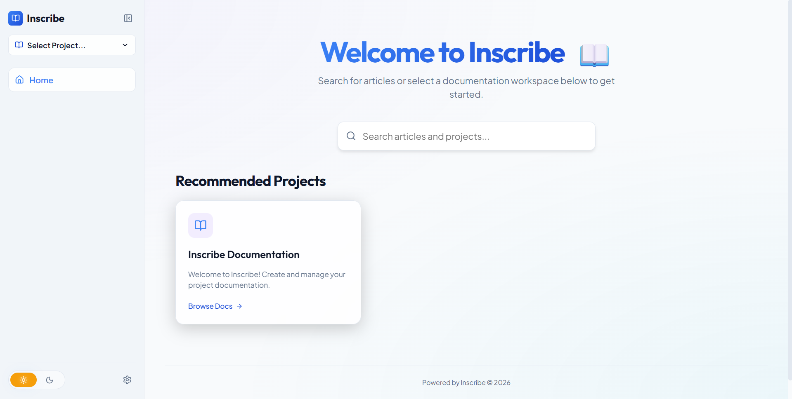
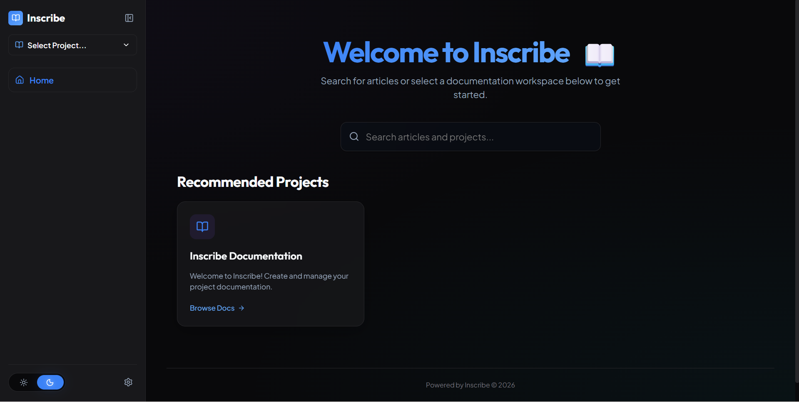
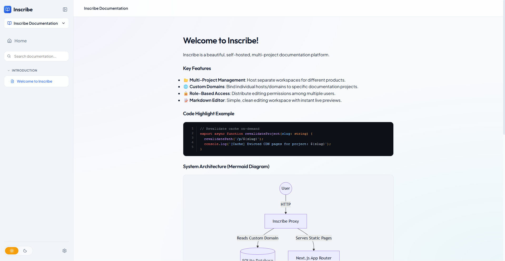
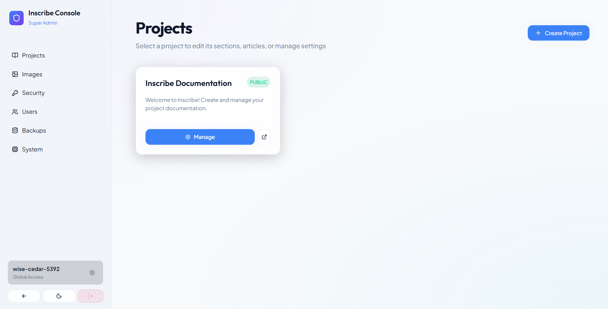
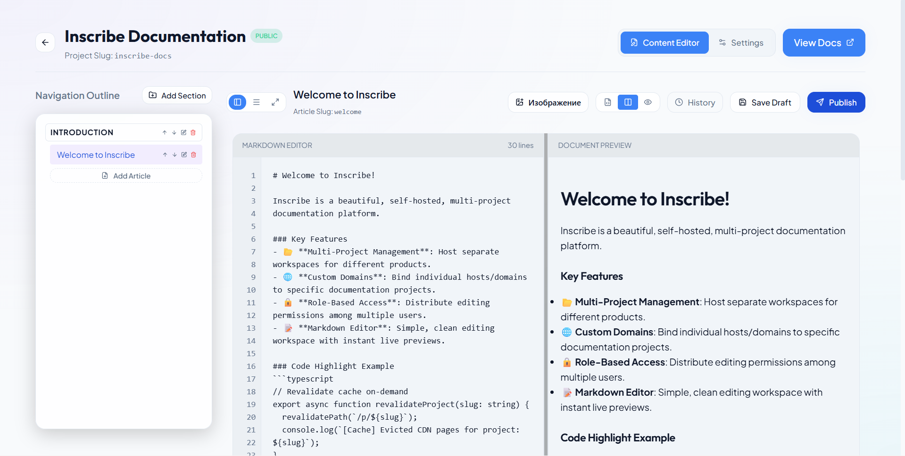

<div align="center">
  
  <h1>Inscribe 📖</h1>
  <p><strong>A lightweight, self-hosted GitBook alternative built for fast, open, and secure public documentation.</strong></p>
  
  <p>
    <a href="#"></a>
    <a href="LICENSE"></a>
    
    
    
  </p>
</div>

---

## ⚡ Overview
**Inscribe** is a self-hosted documentation workspace and GitBook alternative designed specifically for publishing public-facing docs. Unlike platforms that force readers to register or log in, Inscribe is built for **open access**—your documentation is instantly available to read, search, and navigate without passwords, accounts, or paywalls. 

Powered by Next.js and SQLite, it is designed to be as lightweight and easy to deploy as possible, focusing on providing a clean reading experience and a fast publishing workflow without the operational overhead of traditional databases.

## 📷 Screenshots

### Reader Interface (Light & Dark Theme)

| Light Theme Homepage | Dark Theme Homepage | Reader Workspace |
| --- | --- | --- |
|  |  |  |

### Admin Console (Manage Workspace)

| Admin Dashboard | Content Editor & Settings |
| --- | --- |
|  |  |

### Key Features
- 🌐 **Open & Public by Default:** Host documentation that is immediately accessible to readers with zero barriers, while keeping content management secure for editors.
- 🪶 **Low Resource Consumption:** By using an embedded SQLite database instead of PostgreSQL or MySQL, Inscribe can run comfortably on very low-tier VPS instances with minimal RAM usage.
- 🚀 **High-Performance SQLite (WAL):** The database is configured to use Write-Ahead Logging (WAL) mode, ensuring concurrent read/write operations remain fast and non-blocking.
- 🔍 **Built-in Full-Text Search:** Powered by SQLite's FTS5 extension. Search is natively integrated and extremely fast for small to medium datasets, eliminating the need to deploy and maintain external services like ElasticSearch.
- ✨ **Rich Content Support:** The markdown editor natively supports code snippets with syntax highlighting and **Mermaid diagrams**.
- 🖼️ **On-the-Fly Image Optimization:** Uses `sharp` (the industry standard for Node.js) to automatically compress and convert uploaded images to **WebP**, reducing bandwidth usage.
- 🌐 **Project Isolation & Custom Domains:** You can create multiple documentation projects within a single instance. Each project can be mapped to its own custom domain directly through the interface.
- 🛡️ **Modern Security Defaults:** Includes standard security practices out-of-the-box: Token-Based Authentication (JWT), Mandatory 2FA/TOTP for administrators, and token-bucket rate-limiting to prevent brute-force attacks.

## 🛠️ Installation & Deployment

Inscribe is designed to run exclusively in containers, making deployment consistent, clean, and fully isolated. We provide an interactive `setup.sh` script to automate the initial configuration, generate secrets, and launch the Docker container.

### Method 1: Interactive Setup (Recommended)

We provide an interactive `setup.sh` script that automates the initial configuration, generates secure secrets, and launches the Docker container.

1. **Clone the repository:**
   ```bash
   git clone https://github.com/your-org/inscribe.git
   cd inscribe
   ```

2. **Run the interactive setup script:**
   This script will automatically detect free ports, generate a secure `.env.production` file, build the Docker image, and start the container.
   ```bash
   chmod +x setup.sh
   ./setup.sh
   ```

3. **Save your initial credentials:**
   Once the container is healthy, the script will print your **Initial Admin Username** and **One-Time Entry Code** directly to the terminal. *Copy these immediately, as they will only be generated once.*

---

### Method 2: Manual Container Setup

If you prefer to configure your environment manually without the interactive script, you can set up the required environment variables yourself.

1. **Clone the repository:**
   ```bash
   git clone https://github.com/your-org/inscribe.git
   cd inscribe
   ```

2. **Create the Environment File:**
   Create a file named `.env.production` in the root directory and populate it with the following required variables:
   ```env
   # The port the container will expose
   INSCRIBE_PORT=3000
   
   # The domain for the admin panel (e.g., localhost or admin.your-domain.com)
   INSCRIBE_ADMIN_DOMAIN=localhost
   
   # A secure, random 32-character hex string for JWT signing
   INSCRIBE_JWT_SECRET=your_super_secret_random_string_here
   
   # Initial credentials (only used on the very first run to seed the DB)
   INSCRIBE_INITIAL_ADMIN_USERNAME=admin-manual
   INSCRIBE_INITIAL_ADMIN_ONE_TIME_CODE=123456
   ```

3. **Start the application:**
   ```bash
   docker compose -f deploy/docker-compose.yml up -d --build
   ```

4. **Login:**
   Navigate to `http://localhost:3000/admin` (or your configured admin domain) and log in using the `INSCRIBE_INITIAL_ADMIN_USERNAME` and `INSCRIBE_INITIAL_ADMIN_ONE_TIME_CODE` you specified. You will immediately be prompted to configure 2FA.

---

## 🏁 Quick Start (What's Next?)

Once your container is running, follow these steps to get your documentation online:

1. **Access the Admin Panel:**
   Navigate to `http://<your-server-ip>:3000/admin` (or your configured custom domain) in your browser.
2. **Secure Your Account:**
   Log in using the auto-generated `superadmin` credentials. You will immediately be forced to set up Two-Factor Authentication (2FA) using an app like Google Authenticator or Authy.
3. **Create a Project:**
   Inscribe is multi-tenant. Your first step is to create a "Project". Give it a name and assign it a custom slug (e.g., `guide`).
4. **Write and Publish:**
   Enter your new project workspace. Create sections, write articles using the built-in Markdown editor (with Mermaid and Code snippet support), and hit "Publish".
5. **View Your Docs:**
   Your published documentation will be instantly available at `http://<your-server-ip>:3000/p/<project-slug>`.

---

## 📚 Documentation
Dive deeper into the technical architecture of Inscribe:
- [Authentication & Security](docs/auth.md) - Details on JWT sessions, 2FA, and rate limiting.
- [Application Architecture](docs/architecture.md) - Next.js routing, proxying, and caching layers.
- [Database Structure](docs/database.md) - SQLite schema, FTS5 configuration, and backups.
- [Project Structure](docs/project_structure.md) - Codebase organization.

---

## 💻 Tech Stack
- **Framework:** Next.js (App Router)
- **Language:** TypeScript
- **Database:** SQLite (via `better-sqlite3`)
- **Styling:** Vanilla CSS (CSS Variables for themes)
- **Authentication:** JWT (`jose`) + TOTP (`otpauth`)
- **Content Processing:** `remark`/`rehype` ecosystems, `sharp` (for WebP image compression)

---

## 📄 License

This project is licensed under the **GNU Affero General Public License v3.0 (AGPLv3)**.

- ✅ **Commercial & Personal Use:** You are free to run, copy, modify, and distribute this software.
- 🔓 **Share Alike (Network Use):** If you modify this software and run it on a server for users over a network (e.g. hosting it as a SaaS), you **must** make the modified source code available under the same AGPLv3 license.

For full details, see the [LICENSE](LICENSE) file.

### Third-Party Licenses
- **Fonts (Outfit, Plus Jakarta Sans):** SIL Open Font License 1.1 (OFL)
- **Icons (Lucide):** ISC License
- **Framework & Libraries (Next.js, React, SQLite, etc.):** MIT License
