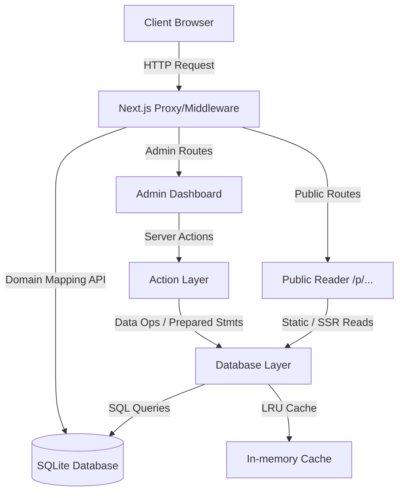

# Application Architecture

This document outlines the high-level architecture of Inscribe.

## Core Components

### 1. Routing & Rewrite Proxy (`src/proxy.ts`)
Inscribe supports hosting documentation under custom domains. The request flow is handled by a middleware-like proxy component:
- **Admin Routing**: Intercepts requests destined for the administration panel (`/admin` and subpaths) and restricts access by enforcing the optional `INSCRIBE_ADMIN_DOMAIN` environment variable.
- **Domain Mapping**: Inspects the incoming request hostname. If it matches a project's custom domain, it rewrites the request internally to the corresponding public path: `/p/[projectSlug]/...`.
- **API Resolution**: Queries `/api/domain-mapping` to resolve mapping dynamically and caches results for optimal responsiveness.

### 2. Database & Storage Layer (`src/lib/db/`)
The database layer uses SQLite (via `better-sqlite3`) to store all application data.
- **Single Connection Instance**: The database connection is instantiated once, ensuring concurrent queries leverage Write-Ahead Logging (WAL) and immediate timeouts (`10000ms`) to avoid blocking.
- **Prepared Statement Caching**: Every queries/statement is compiled once during startup (or first execution) and cached globally within its module, yielding maximum performance.
- **Automated Backup & Debounce**: Writes trigger a debounced backup worker to avoid disk-thrashing, running `PRAGMA integrity_check` upon creation to ensure data validity.

### 3. Server Actions & Security
- **Authentication**: JWT token cookies (`SameSite=Strict`, `HttpOnly`, `Secure` in production) combined with 2FA/TOTP authorization codes.
- **Lockout Logic**: In-memory and DB tracking of failed logins to prevent brute-force attacks.
- **Input Validation**: All server actions pass incoming data through strict Zod schemas in `src/lib/validation.ts`.
- **Security Headers**: Content Security Policy (CSP), X-Frame-Options (DENY), and X-Content-Type-Options (nosniff) configured inside `next.config.ts`.

### 4. Search & Caching Layer
- **FTS5 Full-Text Search**: Leverages SQLite's virtual FTS5 tables to index stripped plain-text content of articles. Snippet highlighting is done directly inside the database query.
- **LRU Cache**: Utilizes the standard `lru-cache` package with explicit eviction and size boundaries for caching raw database reads.
