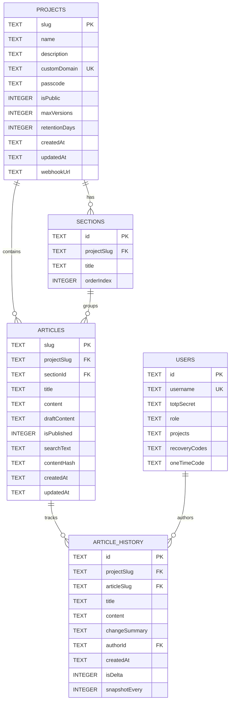

# Database Architecture & Schema

Inscribe utilizes a relational SQLite database powered by `better-sqlite3`. This document details the database configuration, schema layout, and operational procedures.

## Database Configuration

SQLite is configured with the following parameters for high concurrency and safety:
- **Write-Ahead Logging (WAL)**: Enabled via `PRAGMA journal_mode = WAL`. This allows concurrent readers to read the database while writes are in progress.
- **Foreign Keys**: Enforced via `PRAGMA foreign_keys = ON`.
- **Busy Timeout**: Configured to `10000ms` to prevent immediate failures under high write concurrency (e.g., during parallel server rendering/page collection).

---

## Database Schema

---

### 1. Users
Stores user authentication details and assigned project slugs for access control.
- `id` (TEXT, PK): Unique user identifier.
- `username` (TEXT, UK): Lowercased unique username.
- `totpSecret` (TEXT): Encoded Base32 secret for 2FA. Set to `"PENDING"` for new invitations.
- `role` (TEXT): Either `superadmin` or `editor`.
- `projects` (TEXT): JSON array of project slugs assigned to the user.
- `recoveryCodes` (TEXT): Comma-separated list of SHA-256 hashed recovery codes.
- `oneTimeCode` (TEXT): Generated one-time code for new user verification.

### 2. Projects
Stores project-level configurations, domains, and access settings.
- `slug` (TEXT, PK): URL friendly identifier (e.g. `guide`).
- `name` (TEXT): Human-readable name.
- `description` (TEXT): Description.
- `customDomain` (TEXT, UK): Optional mapped domain.
- `passcode` (TEXT): Optional project-wide password protect.
- `isPublic` (INTEGER): Flag indicating whether it's public.
- `maxVersions` (INTEGER): Maximum number of revision history items to keep (pruning).
- `retentionDays` (INTEGER): Age-based revision retention threshold.
- `createdAt` / `updatedAt` (TEXT): Timestamps.

### 3. Sections
Groups articles within a project to form a table of contents.
- `id` (TEXT, PK): Unique section ID.
- `projectSlug` (TEXT, FK): Mapped to `projects.slug`.
- `title` (TEXT): Header title.
- `orderIndex` (INTEGER): Ordering weight.

### 4. Articles
Contains both draft and published states of the documentation pages.
- `slug` (TEXT, PK): Article URL identifier.
- `projectSlug` (TEXT, FK): Mapped to `projects.slug`.
- `sectionId` (TEXT, FK): Mapped to `sections.id` (nullable if unsectioned).
- `title` (TEXT): Current page title.
- `content` (TEXT): Currently published Markdown content.
- `draftContent` (TEXT): Auto-saved draft content (shown in editor workspace).
- `isPublished` (INTEGER): Flag for publication state.
- `searchText` (TEXT): Stripped plain-text for indexing.
- `contentHash` (TEXT): SHA-256 hash of the content to track modifications.

### 5. Article History (Revisions)
Logs publication history for rollsback and change logs.
- `id` (TEXT, PK): Unique revision log ID.
- `projectSlug` (TEXT, FK) / `articleSlug` (TEXT, FK)
- `title` / `content`: Revision snapshot.
- `changeSummary` (TEXT): Commit message.
- `authorId` (TEXT, FK)
- `createdAt` (TEXT): Revision timestamp.

---

## Full-Text Search (FTS5)

A virtual FTS5 index is updated via triggers/code hooks whenever an article's `searchText` is modified. Highlighting uses SQLite's built-in `snippet()` function for performant, server-side search results.

## Backup Mechanism
- **Rolling Backups**: Automatically saved on database writes. Keeps up to 5 copies.
- **Debouncing**: Database saves are debounced by a 30-second window, ensuring the disk is not hammered during frequent auto-saves.
- **Integrity Validation**: Runs `PRAGMA integrity_check` on backup outputs immediately after saving to ensure backups are corruption-free.
